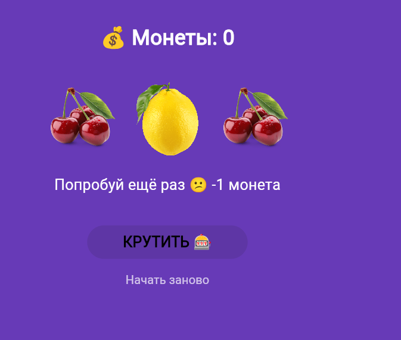

# Лабораторная работа №6. Flutter: StatefulWidget и управление состоянием

## Выполнение

**Студент:** Катаржин Г.М.

**Группа:** ИСП-232 

**Дата сдачи:** 13.05.26

## Что изучили

1. **Разница между StatelessWidget и StatefulWidget** — научились создавать виджеты с изменяемым состоянием. Поняли, что StatefulWidget требует реализации метода `createState()` и разделения на два класса: сам виджет и объект State, который хранит данные.

2. **Управление состоянием через setState()** — освоили механизм обновления UI. Метод `setState()` сигнализирует Flutter о необходимости перерисовать виджет с новыми значениями переменных.

3. **Асинхронное программирование в Flutter** — реализовали реалистичную прокрутку барабанов с тремя фазами скорости, используя `async`/`await` и `Future<void>`. Научились создавать паузы с помощью `Future.delayed()`.

4. **Анимации виджетов** — применили `AnimatedOpacity` для эффекта мигания барабанов во время вращения и `AnimatedSwitcher` с `ValueKey` для плавной анимированной смены текста сообщения.

5. **Рефакторинг и выделение виджетов** — вынесли повторяющийся код (три барабана) в отдельный виджет `SlotRow` с обязательными `required` параметрами, что сделало код чище и безопаснее.

## Скриншот приложения



## Инструкция по запуску

1. Убедитесь, что установлен Flutter SDK и настроен редактор (VS Code/Android Studio)

2. Клонируйте репозиторий:
```bash
git clone <URL_репозитория>
```

3. Установите зависимости:
```bash
flutter pub get
```

4. Запустите приложение в Chrome:
```bash
flutter run -d chrome
```

5. Нажмите кнопку **"КРУТИТЬ"** для начала игры. При совпадении трёх одинаковых символов вы получаете монеты (+3 за обычные символы, +10 за три семёрки).


